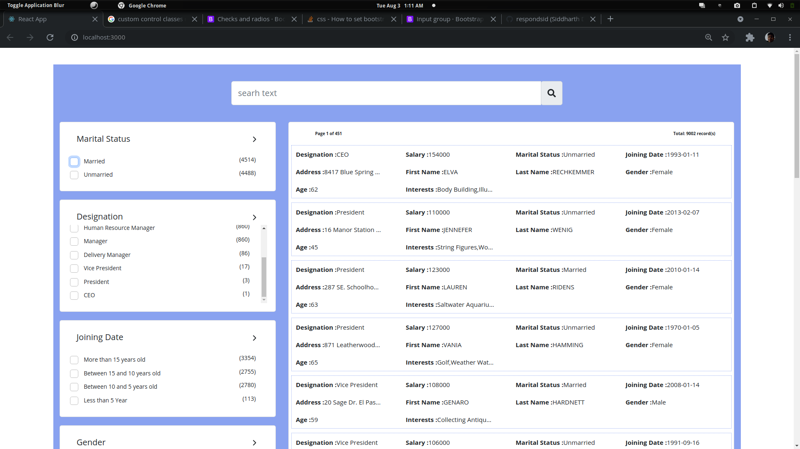

## Makle sure docker compose and docker is installed
Start Docker compose from elastic folder

## Install rest extension in VS code

1. Install vs code rest client. elastic.http is the input file to setup test index collection in elastic search for UI

2. Run first two rest apis one after the other this should create and populaste accounts collection in local elastic search instance

### `npm start`

Runs the app in the development mode. 
Open [http://localhost:3000](http://localhost:3000) to view it in the browser.

The page will reload if you make edits. 
You will also see any lint errors in the console.

It should show data driven facet view as follows:

